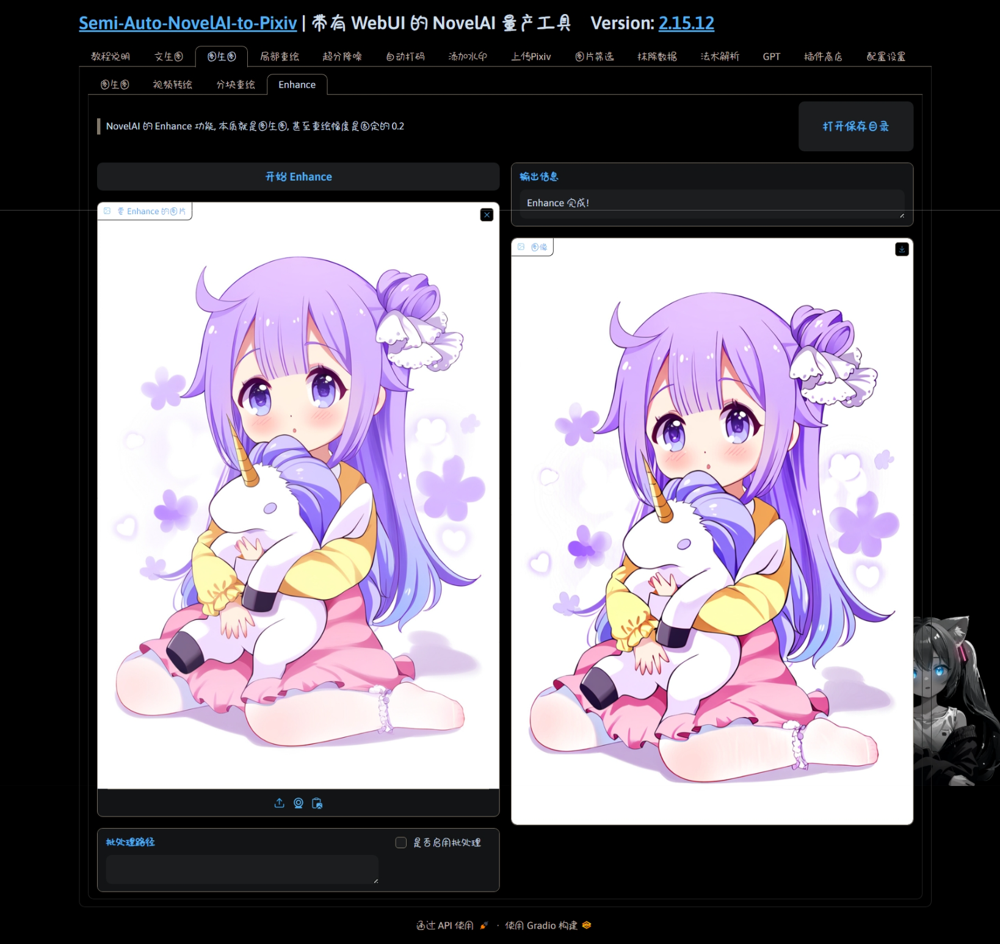

  </a>

<h1 align="center">sanp_plugin_enhance</h1>
<h4 align="center">✨批量 Enhance 图片✨</h4>

    
    
    
    
    

## 💬 介绍

等同于使用 NovelAI 官网, 我为它添加了批量处理功能

## ✨ 功能

## 💿 安装

在[主体项目](https://github.com/zhulinyv/Semi-Auto-NovelAI-to-Pixiv) `plugin\i2i` 目录下直接克隆本项目
